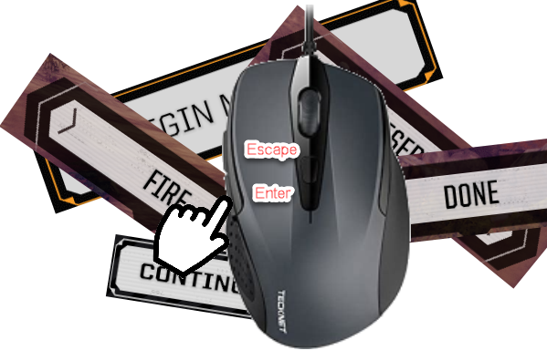

# Bind Enter To Mouse

A very simple but extremely useful mod which binds the enter key to mouse button 4.

Nearly every dialog and action can be activated by the enter key, but it is not bindable.  The enter key's position makes it more difficulty to use than necessary.

Some of the most used actions:
* Combat - just about every confirmation (fire, reserve, accept sensor lock, etc.)
* Nearly every "confirm" action of dialogs.
* Repair mech.
* Contract negotiations, begin mission.

# mod.json Settings

|Name|Default|Description|
|--|--|--|
|MouseBind|Mouse4|The mouse button to bind to.  |

# Compatibility 
Save to add and remove from existing saves.
Should be compatible with any mod that does not rebind the target mouse button or the "Return" keybinding action.

# Thanks

Special thanks to gponick.  This is completely based off of their Escape Key binding code found here:
[https://github.com/gponick/BTMLAddBindableEscapeKey](https://github.com/gponick/BTMLAddBindableEscapeKey)
